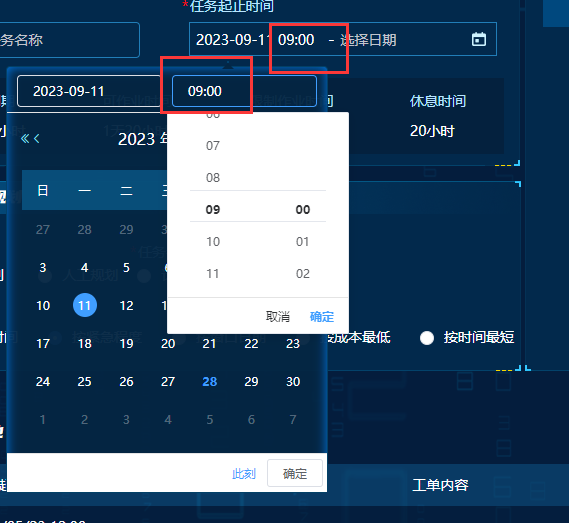

# `<el-date-picker>`确定时间选项

## 选择返回时间格式 format 和 value-format

<br/>

```html
<el-date-picker
  v-model="startValue"
  prefix-icon="0"
  clear-icon
  align="right"
  type="datetime"
  placeholder="选择日期"
  format="yyyy-MM-dd HH:mm"
  value-format="yyyy-MM-dd HH"
  @change="onHandleChangeStartDate"
></el-date-picker>
```

其中 format 和 value-format 控制下拉框和返回值的时间格式 :
**yyyy-MM-dd HH:mm:ss**
<br/>

**实例：**<br/>

<center>
    
</center>

# 在日期中添加指定接口返回的信息

**要求实现：** 在上图的每个日期下面显示当天的风速<br/>
使用 cellClassName 可以配置时间格式

**参考文章：**[element 时间选择器加标记](https://blog.csdn.net/m0_46301672/article/details/128951123)
